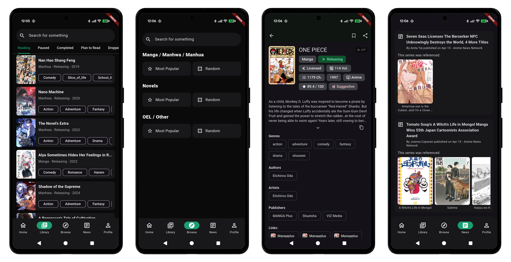

# BakaHyou

An unofficial, free and open source app for MangaBaka

## Download

Go to the [releases](https://github.com/Oazzies/BakaHyou/releases) page.

*Requires Android 6.0 or higher.*

## Features

<h3>Implemented</h3>

* Series with info (Titles, Chips, Description, etc)
* Library (Adding, Editing, Deleting)
* Browsing
* Seeing news
* Basic Statistics (At a Glance, Library Snapshot)

    
<h3>Upcoming</h3>

* Home Page (Discover, Current, Activity)

* More browse shortcuts(Recommendations, etc)
* Browsing suggestions
* Scan barcode to search (Improved once Works comes out)

* Multiple series covers
* Collections
* Works
* Better Tags Display

* More Statistics

* Customization (List styles, App styles, Preferences, etc)
* Language Support
* Content Rating Preferences

* On Boarding
* Optional Notifications for various things
* A LOT of UI/UX improvements

MB Api Needed:
* Homepage Discover feed
* More browse shortcuts, so recommendation feed
* Seeing other profiles

    
<h3>Not Planned</h3>

Its not a definite no, but its a list that is really really low priority, not fit for an app or not possible
* Data Moderation, Submissions, etc in App
* API/Any Documentation in App
* Import/Export in App
* Bookmarklet
* Quick Nav

## Disclaimer

Like MangaBaka the app is NOT a reading site - we do not link to or host any copyrighted reading content

#### License

<pre>
Licensed under the Apache License, Version 2.0 (the "License");
you may not use this file except in compliance with the License.
You may obtain a copy of the License at

http://www.apache.org/licenses/LICENSE-2.0

Unless required by applicable law or agreed to in writing, software
distributed under the License is distributed on an "AS IS" BASIS,
WITHOUT WARRANTIES OR CONDITIONS OF ANY KIND, either express or implied.
See the License for the specific language governing permissions and
limitations under the License.
</pre>

